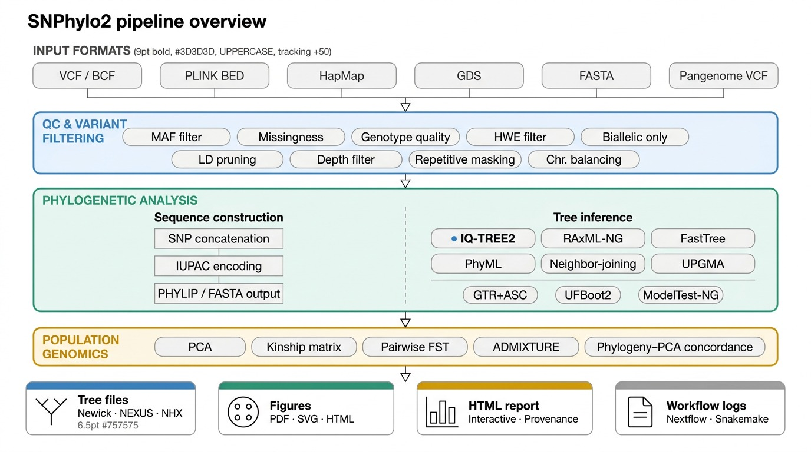

# SNPhylo2: A Scalable, Modular, and Reproducible Pipeline for Phylogenetic Inference from Large-Scale SNP Datasets

[](https://github.com/ank-man/snphylo2)
[](https://www.python.org/)
[](LICENSE)
[](https://github.com/ank-man/snphylo2/actions)
[](https://snphylo2.readthedocs.io)

<p align="center">
  
  <br>
  <b>Figure 1.</b> SNPhylo2 analysis workflow. The pipeline processes raw VCF files through quality control, variant filtering, LD pruning, and phylogenetic tree construction, with integrated population genomics analyses including PCA, FST, and LD decay.
</p>

## Overview

SNPhylo2 is a next-generation computational pipeline designed for phylogenomic inference from large-scale SNP datasets. This tool represents a complete redesign of the original [SNPhylo](https://chibba.agtec.uga.edu/snphylo) (Lee et al., 2014) for the era of population-scale resequencing, addressing computational challenges of modern projects with thousands to hundreds of thousands of samples and integrated population genomics capabilities.

**Original SNPhylo**: https://chibba.agtec.uga.edu/snphylo

### Key Features

- High-throughput processing of 10,000+ samples and 100M+ SNPs via chunked streaming architecture
- Support for multiple input formats: VCF, BCF, PLINK binary, HapMap, and GDS
- Integration with modern phylogenetic inference engines: IQ-TREE2, RAxML-NG, FastTree
- Comprehensive population genomics module: PCA, FST, IBS matrices, and LD decay analysis (PopLDdecay-style)
- Containerized deployment via Docker and Singularity
- Workflow integration with Nextflow and Snakemake for HPC and cloud environments
- Checkpoint and resume capability for long-running analyses

## System Requirements

### Hardware Requirements

| Component | Minimum | Recommended |
|-----------|---------|-------------|
| CPU | 4 cores | 16+ cores |
| RAM | 8 GB | 32+ GB |
| Storage | 50 GB | 200+ GB SSD |
| Network | Standard | High-speed (for cloud) |

### Software Dependencies

**Core Requirements:**
- Python 3.10 or higher
- Conda or Mamba package manager (recommended)

**External Bioinformatics Tools:**
- IQ-TREE2 (version 2.3.0+)
- PLINK2 (version 2.0+)
- BCFtools (version 1.19+)
- Samtools (version 1.19+)

**Optional Dependencies:**
- R (version 4.3.0+) with packages: SNPRelate, gdsfmt, ggtree
- Nextflow (version 21.0+)
- Snakemake (version 7.0+)
- Docker or Singularity/Apptainer

## Installation

### Method 1: Conda Installation (Recommended)

```bash
conda install -c bioconda -c conda-forge snphylo2
```

This installs SNPhylo2 with all external dependencies (IQ-TREE2, PLINK2, BCFtools).

### Method 2: Installation from Source

```bash
git clone https://github.com/ank-man/snphylo2.git
cd snphylo2
pip install -e ".[dev]"
```

Install external tools separately following their respective documentation.

### Method 3: Container Deployment

Docker:
```bash
docker pull ghcr.io/ank-man/snphylo2:latest
docker run -v $(pwd):/data ghcr.io/ank-man/snphylo2:latest run -v /data/input.vcf.gz -o /data/results
```

Singularity/Apptainer (for HPC):
```bash
singularity pull docker://ghcr.io/ank-man/snphylo2:latest
singularity run snphylo2_latest.sif run -v input.vcf.gz -o results/
```

## Quick Start

### Complete Pipeline (One Command)

```bash
snphylo2 run -v input.vcf.gz --threads 16 -o results/
```

This executes: (1) Quality control, (2) Variant filtering, (3) LD pruning, (4) Phylogenetic tree construction, (5) HTML report generation.

### Step-by-Step Analysis

**Step 1: Quality Control and Filtering**
```bash
snphylo2 filter -v input.vcf.gz -o filtered.vcf.gz \
    --maf 0.05 \
    --max-missing 0.2 \
    --min-depth 5
```

**Step 2: Linkage Disequilibrium Pruning**
```bash
snphylo2 prune -i filtered.vcf.gz -o pruned.vcf.gz \
    --window 50 \
    --step 10 \
    --r2 0.2
```

**Step 3: Phylogenetic Tree Construction**
```bash
snphylo2 tree -i pruned.vcf.gz -o tree.nwk \
    --engine iqtree2 \
    --model GTR+ASC \
    --bootstrap 1000
```

**Step 4: Population Genomics Analysis**
```bash
snphylo2 ld-decay -v input.vcf.gz -m metadata.tsv --plot
```

## Detailed Workflow Description

### Input Processing

SNPhylo2 accepts multiple input formats:
- **VCF/BCF**: Standard variant call format (compressed and indexed)
- **PLINK**: Binary format (.bed/.bim/.fam)
- **HapMap**: Legacy haplotype map format
- **GDS**: Genomic Data Structure format
- **FASTA**: Sequence alignments

### Quality Control Module

Performs comprehensive dataset assessment:
- Sample-level metrics: missingness, heterozygosity, depth distribution
- Variant-level metrics: call rate, quality scores, allele frequencies
- Transition/transversion ratio calculation
- Sex checking (for diploid species with sex chromosomes)
- Duplicate sample detection via IBS analysis

### Variant Filtering

Configurable filters:
- Minor allele frequency (MAF) threshold
- Maximum missingness per variant and per sample
- Minimum read depth requirements
- Genotype quality scores
- Biallelic SNP filtering
- Hardy-Weinberg equilibrium testing
- Ts/Tv ratio filtering

### Linkage Disequilibrium Pruning

Implements LD-based SNP pruning to reduce redundant information:
- **Window-based pruning**: Sliding window with step size and r2 threshold
- **Pairwise pruning**: PLINK2 indep-pairwise algorithm
- **Tag SNP selection**: Information-maximizing subset selection

### Phylogenetic Tree Construction

Multiple tree-building engines supported:

**IQ-TREE2** (recommended):
- Ultrafast bootstrap approximation (UFBoot)
- ModelFinder for automatic model selection
- Ascertainment bias correction for SNP-only data

**RAxML-NG**:
- Optimized for large datasets
- Bootstrap and ML tree search

**FastTree**:
- Approximate maximum likelihood
- Suitable for very large datasets (>1000 samples)

### Population Genomics Module

**Principal Component Analysis (PCA):**
- Eigen-decomposition on genotype matrix
- Missing data imputation to mean
- Population structure visualization

**FST Calculation:**
- Weir-Cockerham pairwise FST estimator
- Population differentiation analysis

**Identity-by-State (IBS):**
- Pairwise distance matrix calculation
- Sample relationship inference

**LD Decay Analysis:**
- r2 decay with physical distance (PopLDdecay-style)
- Half-decay distance calculation
- Population-stratified analysis

**Kinship Matrix:**
- VanRaden method for relationship estimation

## HPC and Cloud Deployment

### Nextflow on SLURM

```bash
nextflow run workflows/nextflow/main.nf \
    -profile slurm \
    --input large_dataset.vcf.gz \
    --output results/
```

### Snakemake with Conda

```bash
snakemake --cores 16 --use-conda \
    -s workflows/snakemake/Snakefile \
    --config input=large_dataset.vcf.gz
```

### AWS Batch

```bash
nextflow run workflows/nextflow/main.nf \
    -profile aws \
    --input s3://bucket/dataset.vcf.gz
```

## Example: Rice 3K Analysis

```bash
# Download demo data
python examples/download_demo_data.py --dataset rice --samples 50

# Run complete pipeline
snphylo2 run \
    -v demo_data/rice_3k_50accessions_chr1.vcf.gz \
    --metadata demo_data/rice_3k_50accessions_chr1.metadata.tsv \
    --threads 8 \
    -o rice_results/

# Generate manuscript figures
python examples/generate_manuscript_figures.py \
    demo_data/rice_3k_50accessions_chr1.vcf.gz \
    --metadata demo_data/rice_3k_50accessions_chr1.metadata.tsv \
    -o rice_figures/ \
    --format pdf
```

**Outputs:**
- `rice_results/snphylo2_output.tree.nwk` - Phylogenetic tree (Newick format)
- `rice_results/snphylo2_output_report.html` - Interactive HTML report
- `rice_figures/figure_ld_decay.pdf` - LD decay curves by subpopulation
- `rice_figures/figure_pca_pc1_pc2.pdf` - PCA with population coloring

## Documentation

- [Installation Guide](docs/installation.md)
- [Tutorials](docs/tutorials/)
- [Configuration Reference](docs/configuration.md)
- [API Documentation](docs/api/)
- [Benchmarks](docs/benchmarks.md)

## Contributing

Contributions are welcome. See [CONTRIBUTING.md](CONTRIBUTING.md) for guidelines.

Priority areas:
- Additional tree building engines (MrBayes, BEAST)
- Polyploid support (dosage-aware encoding)
- Pangenome graph compatibility
- Cloud deployment guides (AWS, GCP, Azure)

## Acknowledgments

SNPhylo2 is built upon the foundation of the original [SNPhylo](https://chibba.agtec.uga.edu/snphylo) tool developed by Tae-Ho Lee and colleagues (Lee et al., 2014, BMC Genomics). We thank the original authors for their pioneering work in automated phylogenomic pipeline development.

**Original SNPhylo Website**: https://chibba.agtec.uga.edu/snphylo

## License

SNPhylo2 is released under the MIT License. See [LICENSE](LICENSE) for details.

## Contact

- **Issues**: [github.com/ank-man/snphylo2/issues](https://github.com/ank-man/snphylo2/issues)
- **Discussions**: [github.com/ank-man/snphylo2/discussions](https://github.com/ank-man/snphylo2/discussions)
- **Email**: Ankush Sharma (mr.ank2999@gmail.com)

---

**Developed for the phylogenomics community**
